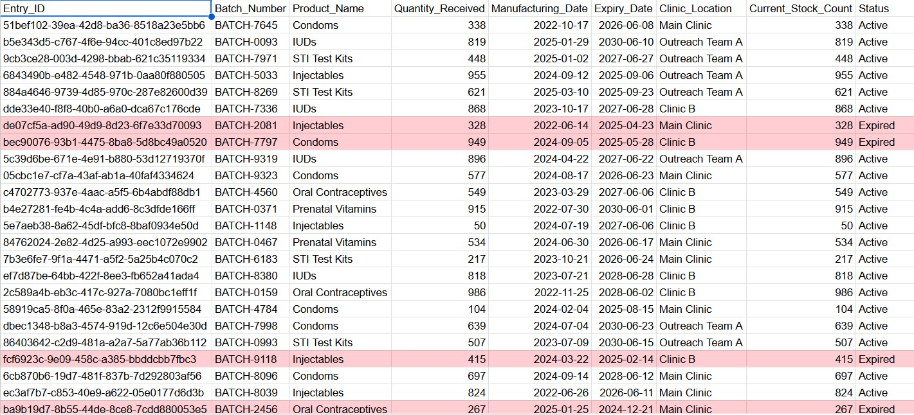

# 🧪 Zoho Inventory Alert System for Google Sheets

This Google Apps Script solution empowers you to efficiently manage your inventory within a Google Sheet, providing automated alerts for:

- ✅ Products that are **expiring soon** or have already **expired**.
- ⚠️ Products that are **low on stock**.

The script dynamically updates your Google Sheet with status highlights and dispatches styled HTML email notifications to a configured recipient.

Here's a sample of my Google Sheets:



---

## 📋 Features

This system offers a robust set of features to keep your inventory in check:

- 📆 **Expiry Alerts**:
  - Automatically highlights rows in your Google Sheet based on their expiry status (expired, expiring soon, or active).
  - Sends proactive email notifications at configurable intervals (e.g., 35 days and 1 day before expiry) and upon expiration.
  - Updates the "Status" field in your sheet to reflect the current expiry state.

- 📉 **Low Stock Alerts**:
  - Highlights rows when the current stock count falls below a predefined threshold.
  - Sends email alerts only once per unique stock level change to prevent duplicate notifications.
  - Automatically updates the "Status" field to "Low Stock" for affected items.

- 📧 **Rich Email Notifications**:
  - Generates well-formatted HTML emails containing a clear list of affected products.
  - Each email is tailored to a specific alert type (e.g., "Expiring in 1 Day," "Expired," "Low Stock").

- 🖌️ **Intuitive Sheet Highlighting**:
  - Applies distinct background colors to rows for quick visual identification of urgency:
    - **Light Red (`#FFCDD2`)**: Expired Products
    - **Light Yellow (`#FFF59D`)**: Products Expiring Soon
    - **Light Orange (`#FFECB3`)**: Low Stock Products
    - **White (`#FFFFFF`)**: Normal/Active Products

---

## 🧰 Setup Instructions

### 1. 🧾 Google Sheet Structure

Ensure your Google Sheet includes a header row with the following column names, exactly as specified (case-sensitive):

Entry_ID | Batch_Number | Product_Name | Quantity_Received | Manufacturing_Date | Expiry_Date | Clinic_Location | Current_Stock_Count | Status

### 2. 🧠 Google Apps Script Configuration

1.  Open your Google Sheet.
2.  Navigate to `Extensions` > `Apps Script`.
3.  Paste the provided Apps Script code into the editor.
4.  Locate the following constants at the top of the script and update them with your specific Google Sheet details:

    ```javascript
    const GOOGLE_SHEET_ID = 'YOUR_SPREADSHEET_ID_HERE'; // Replace with your Google Sheet ID
    const GOOGLE_SHEET_NAME = 'Sheet1'; // Update if your sheet tab has a different name
    ```

5.  **Set up the Notification Email**:
    * In the Apps Script editor, go to `File` > `Project Properties`.
    * Click on the `Script Properties` tab.
    * Add a new property with the following details:
        * **Key**: `NOTIFICATION_EMAIL`
        * **Value**: `youremail@example.com` (Enter the email address where you want to receive alerts)

### 3. 🕒 Set Time-Driven Trigger

To automate the checks, set up a time-driven trigger:

1.  In the Apps Script editor, click on the `Triggers` icon (looks like a clock) on the left sidebar.
2.  Click `Add Trigger` (bottom right button).
3.  Configure the trigger as follows:
    * **Choose which function to run**: `runInventoryChecks`
    * **Choose deployment to run**: `Head`
    * **Select event source**: `Time-driven`
    * **Select type of time-based trigger**: `Day timer` (or `Hour timer` for more frequent checks)
    * **Select day of the week**: (Choose all days, or specific days)
    * **Select time of day**: (Choose a suitable time for daily checks)
4.  Click `Save`. You may be prompted to authorize the script; follow the on-screen instructions.

---

## 🧪 Core Functions

The script's primary operations are managed by these key functions:

### `runInventoryChecks()`

> This is the main entry point for the automated checks. It orchestrates the execution of both expiry and low stock product checks. This is the function you should set as your time-driven trigger.

### `checkAndAlertExpiringProducts()`

> Responsible for evaluating the expiry status of products and initiating email alerts when expiry thresholds are met.

### `checkAndAlertLowStockProducts()`

> Manages the process of checking current stock counts against the low stock threshold and sending corresponding alerts.

---

## 🎨 Color Legend

The following color scheme is used to visually represent the status of products in your Google Sheet:

| Status        | Background Color | Hex Code   |
| :------------ | :--------------- | :--------- |
| Expired       | Light Red        | `#FFCDD2`  |
| Expiring Soon | Light Yellow     | `#FFF59D`  |
| Low Stock     | Light Orange     | `#FFECB3`  |
| Active/Normal | White            | `#FFFFFF`  |

---

## 🛠️ Customization

You can easily adjust the alert thresholds and email frequencies by modifying the following constants at the beginning of the Apps Script code:

```javascript
// Expiring Product Alert Configuration
const EXPIRING_SOON_DAYS = 30;         // Products expiring within this many days are considered "nearly expiring"
const ALERT_EMAIL_THRESHOLD_1 = 35;    // Send email when expiry is within this many days
const ALERT_EMAIL_THRESHOLD_2 = 1;     // Send email when expiry is within this many days (24 hours)

// Low Stock Alert Configuration
const LOW_STOCK_THRESHOLD = 5;         // Threshold below which products are considered low on stock


📧 Example Email Notification
Subject Line Examples:

Zoho Inventory Alert: 1 Product(s) Expiring Soon
Zoho Inventory Alert: 3 Product(s) Expired
Zoho Inventory Alert: 2 Product(s) Low on Stock
Email Body Structure (HTML table format):

The email body will contain a clear table listing the affected products with relevant details such as:

Product Name
Batch Number
Expiry Date (for expiry alerts)
Days Remaining (for expiry alerts)
Current Stock Count (for low stock alerts)
Clinic Location
❓ Troubleshooting
🔴 "Missing header" error?

Carefully review your Google Sheet's column headers. They must match the specified names exactly (case-sensitive, including underscores).
📭 No emails received?

Verify that the NOTIFICATION_EMAIL script property is correctly set with a valid email address.
Confirm that your time-driven trigger is active and configured to run the runInventoryChecks() function.
Check the Apps Script execution logs (View > Executions or Execution log in the editor) for any errors or warnings.
👥 Credits
This solution was developed for internal clinic inventory management, demonstrating potential integration capabilities between Zoho, Google Sheets, and Google Apps Script.

📄 License
This project is open-source and distributed under the MIT License, allowing for free use, modification, and distribution.